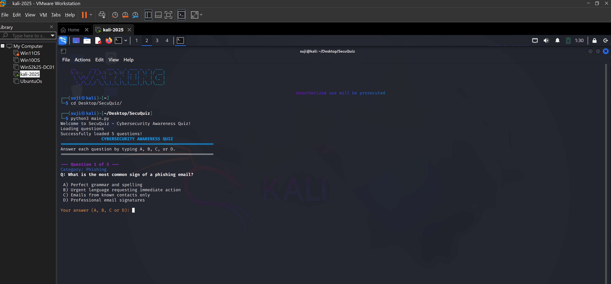
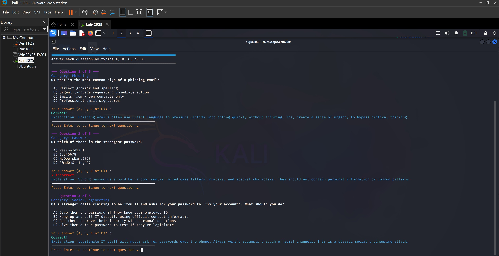
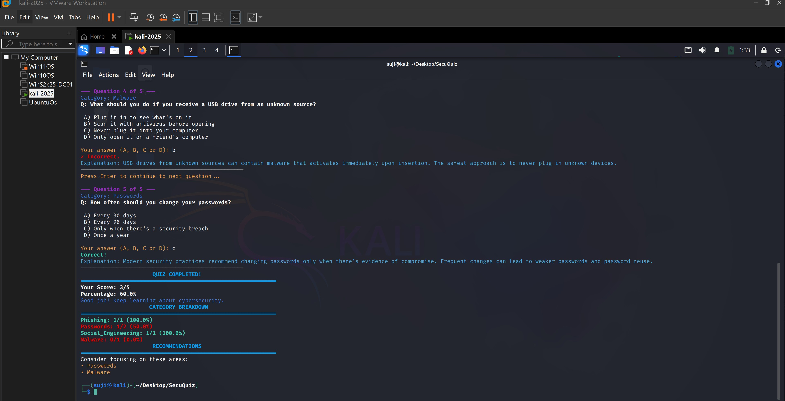

# SecuQuiz - Cybersecurity Awareness Quiz

A comprehensive command-line cybersecurity awareness quiz designed to test and improve knowledge of essential security concepts.

## Features

- **Interactive CLI Interface**: Clean, colorful command-line interface with user-friendly prompts
- **Comprehensive Question Bank**: Questions covering multiple cybersecurity domains
- **Real-time Feedback**: Immediate explanations for each answer
- **Category Tracking**: Performance breakdown by security topic
- **Smart Recommendations**: Personalized suggestions based on quiz performance
- **Progress Tracking**: Visual progress indicators and detailed scoring

## Categories Covered
- **Phishing**: Email security and phishing attack recognition
- **Passwords**: Password security best practices
- **Social Engineering**: Human-based attack vectors
- **Malware**: Malicious software identification and prevention
- **And more...** (easily expandable)

## Installation

### Prerequisites

- Python
- pip

### Setup
1. Clone or download the project:
```bash
git clone <repository-url>
cd SecuQuiz
```

2. Install required dependencies:
```bash
pip install -r requirements.txt
```

3. Run the quiz:
```bash
python3 main.py
```

## Project Structure

```
SecuQuiz/
├── main.py                 #containg program entry point
├── quiz_engine.py          # contains Core quiz logic
├── utils.py                # Utility functions for display and styling
├── requirements.txt        #contain Python dependencies
├── README.md              #conatin Project documentation
├── data/
│   └── questions.json     #serves as database Quiz question
└── src/
    └── question_manager.py # future work 
```

## Usage

1. **Start the Quiz**:
   ```bash
   python3 main.py
   ```

2. **Answer Questions**: Type A, B, C, or D for each question

3. **Review Results**: Get immediate feedback and final performance report

4. **Learn from Mistakes**: Read explanations for each question

## Sample Output





## Adding New Questions

Questions are stored in `data/questions.json`. To add new questions:

1. Open `data/questions.json`
2. Add your question following this format:

```json
{
  "id": 6,
  "category": "network_security",
  "question": "What is the purpose of a firewall?",
  "options": [
    "A) To prevent physical access to computers",
    "B) To block unauthorized network traffic",
    "C) To encrypt data on hard drives",
    "D) To scan for viruses"
  ],
  "correct_answer": "B",
  "explanation": "Firewalls monitor and control incoming and outgoing network traffic based on predetermined security rules."
}
```

## Scoring System
- **Individual Questions**: Correct/Incorrect with explanations
- **Overall Score**: Percentage based on correct answers
- **Category Breakdown**: Performance analysis by topic
- **Recommendations**: Suggested focus areas for improvement

## Dependencies

- `colorama`: For colored terminal output
- `json`: For question data management (built-in)
- `os`, `sys`: For system operations (built-in)

## Contributing

1. Fork the repository
2. Create a feature branch
3. Add your questions or improvements
4. Test thoroughly
5. Submit a pull request

## Question Guidelines

When adding questions:
- Keep questions clear and concise
- Provide accurate, educational explanations
- Cover practical, real-world scenarios
- Include current best practices
- Avoid overly technical jargon

## Educational Value

This quiz covers essential cybersecurity concepts including:
- Recognizing phishing attempts
- Password security best practices
- Social engineering awareness
- Malware prevention
- Security policy compliance

## License

This project is open source. Feel free to use, modify, and distribute for educational purposes.

## Support

For issues, questions, or suggestions:
- Create an issue in the repository
- Review the code for customization options
- Check the question format in `data/questions.json`

## Future Enhancements

- Web-based interface
- User progress tracking
- Additional question categories
- Timed quiz mode
- Difficulty levels
- Question randomization
---

**Stay secure, stay informed!**